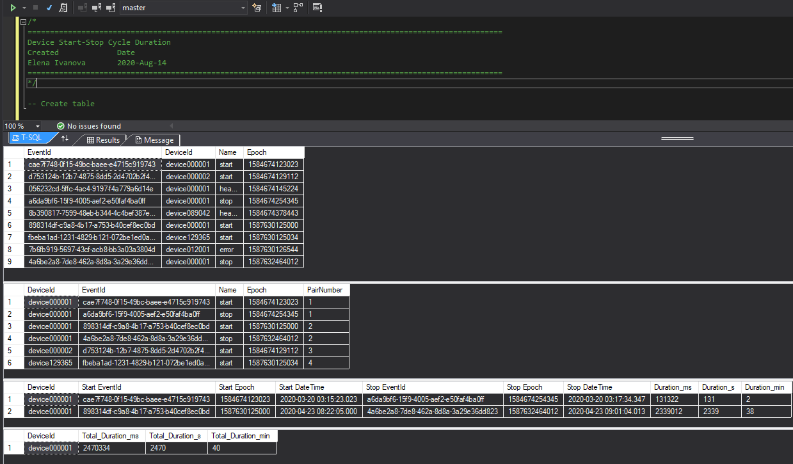

# SQLQuery Device Start-Stop Cycle Duration

### Steps:

1.	Create table
2.	Insert values
3.	Transform data using window function (implying that we receive validated properly paired data)
4.	Prepare data for reporting
5.	Aggregation and Filtering (Alternatively, can be done on Power BI etc Report)
6.	Drop tables 

### Execution Results: 

